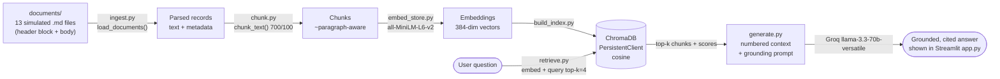

# Project 1 Planning: The Unofficial Guide

> Spec written before the pipeline code. The Retrieval Approach and Chunking
> Strategy sections were updated to match what was actually implemented.

---

## Domain

**Dining & campus life at Brightwood University** (a fictional campus used so every
document references a consistent, knowable set of places — real scraped data would be
inconsistent and harder to evaluate against).

The system covers the day-to-day, lived-experience knowledge students trade with each
other: which dining hall is actually worth the walk, whether the unlimited meal plan
pays off, where the vegan/halal/gluten-free options are, where to study late at night,
and what food you can still get after the dining halls close.

This knowledge is valuable and hard to find through official channels because the
university website tells you a dining hall *exists* and lists its hours — it does **not**
tell you the lunch rush at Hillside Commons means a 20-minute wait, that North Quad's
stir-fry station is the only reliable vegan hot meal, or that the "unlimited" plan is a
bad deal if you sleep through breakfast. That signal lives in reviews, forum threads,
and Discord chatter — exactly the corpus this system indexes.

---

## Documents

13 simulated student-generated documents, each tagged with a `source_type` so the mix
of perspectives (multi-voice forum threads, single reviews, Discord-style chats, curated
guides) is explicit. All are clearly labeled "(simulated)" and live in `documents/`.

| #  | Source | Description | URL or location |
|----|--------|-------------|-----------------|
| 1  | r/BrightwoodU (simulated) | Hillside Commons honest reviews — lunch rush, wait times, food quality | `documents/01-hillside-commons-reviews.md` |
| 2  | r/BrightwoodU (simulated) | North Quad Dining reviews — stir-fry/vegan station, late hours | `documents/02-north-quad-dining-reviews.md` |
| 3  | r/BrightwoodU (simulated) | The Marketplace reviews — food court, prices, meal swipes | `documents/03-the-marketplace-reviews.md` |
| 4  | r/BrightwoodU (simulated) | Riverside Hall reviews — smallest hall, breakfast, atmosphere | `documents/04-riverside-hall-reviews.md` |
| 5  | Forum megathread (simulated) | Meal plan megathread — unlimited vs. block vs. commuter, the math | `documents/05-meal-plan-megathread.md` |
| 6  | Dining guide (simulated) | Vegan & vegetarian dining guide by hall | `documents/06-vegan-vegetarian-guide.md` |
| 7  | Forum thread (simulated) | Halal / kosher / gluten-free options thread | `documents/07-halal-kosher-glutenfree.md` |
| 8  | Discord #food (simulated) | Late-night food after the dining halls close | `documents/08-late-night-food.md` |
| 9  | r/BrightwoodU (simulated) | Coffee on campus — Grindhouse Café vs. Bean Scene | `documents/09-coffee-on-campus.md` |
| 10 | Forum thread (simulated) | Best study spots, ranked | `documents/10-best-study-spots.md` |
| 11 | Review (simulated) | Tewell Library study environment — floors, noise, hours | `documents/11-tewell-library.md` |
| 12 | Discord #newstudents (simulated) | Clubs & orgs intro chatter | `documents/12-clubs-and-orgs.md` |
| 13 | Guide (simulated) | Getting around — transit, parking, off-campus eats | `documents/13-getting-around.md` |

---

## Chunking Strategy

**Chunk size:** 700 characters (~150 tokens)

**Overlap:** 100 characters

**Reasoning:** The corpus is review/forum-thread style — many short, self-contained
opinions, not a few long guides. Two constraints set the size: (1) the embedding model
(`all-MiniLM-L6-v2`) silently truncates input past **256 tokens**, so chunks must stay
comfortably under that — 700 chars ≈ 150 tokens leaves margin; (2) a chunk should be big
enough to hold one complete opinion ("the lunch line at Hillside is brutal after 12,
go before 11:30") so retrieval returns a standalone, citable thought. The 100-char
overlap keeps a review that straddles a boundary from being cut mid-sentence and losing
half its meaning. Chunking is **paragraph-aware**: it packs whole paragraphs up to the
size limit and only hard-splits a paragraph that is itself longer than the limit, so we
avoid breaking words or merging unrelated posts.

---

## Retrieval Approach

**Embedding model:** `all-MiniLM-L6-v2` via `sentence-transformers` — 384-dim, runs
locally (no API cost/latency), fast, and strong on short semantic-similarity text, which
is exactly this corpus.

**Top-k:** 4 — enough to pull in a couple of agreeing/disagreeing voices on a question
without flooding the LLM context with low-relevance chunks. Stored with **cosine**
distance; distance is converted to a `similarity = 1 − distance` score for display and
for a low-relevance cutoff.

**Production tradeoff reflection:** If cost weren't a constraint and this served real
users, I'd weigh moving to a larger hosted embedding model (e.g. an OpenAI
`text-embedding-3-large` or Voyage/Cohere model). The tradeoffs: **context length** —
MiniLM's 256-token cap forces small chunks; a 8k-token embedding model could embed a
whole review thread as one unit and preserve more context. **Domain accuracy** — campus
slang and professor/hall nicknames are effectively out-of-vocabulary for a general small
model, and a larger model (or one lightly fine-tuned on the corpus) would match
nicknames to their referents better. **Multilingual** — an international student body
posts in mixed languages; MiniLM is English-centric, so a multilingual model would
broaden recall. Against all that: **latency and cost** — local MiniLM is ~instant and
free, while a hosted model adds a network round-trip per query and per-document indexing
cost. For a class project the local model wins; for production I'd A/B a hosted model and
measure whether the recall gain justifies the latency.

---

## Evaluation Plan

| # | Question | Expected answer |
|---|----------|-----------------|
| 1 | What do students say about wait times at Hillside Commons during lunch? | Long lines / ~15–20 min waits during the noon rush; students advise going before ~11:30 or after ~1:00 to avoid it. (doc 01) |
| 2 | Which dining hall is best for vegan options? | North Quad Dining — its stir-fry/tofu station is the most reliable hot vegan meal; the vegan guide also points there first. (docs 02, 06) |
| 3 | Is the unlimited meal plan worth it compared to the block plan? | Only worth it if you eat 2–3 dining-hall meals a day; for most students who skip breakfast or eat off-campus, the block (or commuter) plan is cheaper per swipe. (doc 05) |
| 4 | Where's the best quiet place to study late at night? | Tewell Library upper/quiet floors (3rd–4th) and the 24-hour Engineering lounge; ground floor and the Greenhouse are louder/social. (docs 10, 11) |
| 5 | What late-night food is available after the dining halls close? | North Quad serves latest; after that, The Marketplace's grab-and-go, the convenience store, and off-campus options (the 24-hr diner / late pizza) — covered in the late-night thread. (docs 08, 02) |

---

## Anticipated Challenges

1. **Conflicting opinions across documents.** Reviews disagree on purpose (one poster
   loves Hillside, another calls it overrated). Retrieval may surface both, and a naive
   generator could average them into a mushy non-answer or pick one arbitrarily. Mitigation:
   the system prompt tells the model to *report the range of opinions and cite each*, rather
   than declare a single truth, so disagreement is surfaced honestly with `[n]` citations.

2. **Key info split across a chunk boundary.** A meal-plan calculation or a "vegan station
   is at North Quad, but only at dinner" caveat can land half in one chunk and half in the
   next, so top-k retrieval returns only part of it and the answer is incomplete. Mitigation:
   100-char overlap plus paragraph-aware packing keeps related sentences together; this is
   the most likely source of a real failure case and is exactly what the evaluation
   framework's keyword-coverage metric is designed to catch.

3. **Off-topic / out-of-corpus questions.** "What's the football schedule?" has no home
   document; embeddings will still return the 4 nearest chunks, and a model that trusts them
   will hallucinate. Mitigation: a low-relevance score cutoff short-circuits to an explicit
   "not enough information in the collected documents" response before the LLM is called.

---

## Architecture

**Stage → tool:** Ingestion `ingest.py` · Chunking `chunk.py` · Embedding
`sentence-transformers` · Vector store `chromadb` · Retrieval `retrieve.py` ·
Generation Groq (`generate.py`) · Interface `streamlit` (`app.py`) ·
Measurement `evaluate.py`.

---

## AI Tool Plan

**Milestone 3 — Ingestion and chunking:**
Give Claude the Chunking Strategy section (700-char size, 100-char overlap, paragraph-aware,
MiniLM 256-token cap) and the document header format, and ask it to implement
`load_documents()` (parse the `---` header block into metadata + body) and `chunk_text()`.
Verify by printing chunk count and inspecting a few chunks to confirm no word-splitting and
that overlap is present — override the size if chunks routinely exceed ~150 tokens.

**Milestone 4 — Embedding and retrieval:**
Give Claude the Retrieval Approach section (model name, top-k=4, cosine, similarity =
1 − distance) and ask it to implement the ChromaDB persistent store (`build_store`) and
`retrieve()`. Verify with a no-LLM smoke test: query "vegan dining" and confirm the North
Quad / vegan-guide chunks come back on top with sensible scores. Override if the wrong
distance space is used or scores look inverted.

**Milestone 5 — Generation and interface:**
Give Claude the Grounded Generation design (numbered+titled context, the strict system
prompt, the low-relevance cutoff) and ask it to implement `generate_answer()` /
`answer_question()` against the Groq SDK, plus a Streamlit app that shows the answer and an
expander of retrieved chunks with scores. Verify by running the 5 eval questions and an
off-topic question (should hit the "not enough information" path), then override the prompt
wording if the model cites poorly or answers beyond the context.

---

## Stretch Features

> Added after the core pipeline was built, tested, and evaluated. Per the project
> instructions, this section is updated *before* starting each stretch feature.

### 1. Hybrid Search (semantic + BM25)

**Motivation.** Pure dense retrieval can miss exact-term matches — proper nouns and
literal strings like "Grindhouse", "Block 175", or "$2,950" — where lexical overlap
matters more than semantic similarity. The documented failure case (the meal-plan price
conflation) is partly a retrieval problem: the chunk holding the clean labeled price
list isn't always ranked first. BM25 keyword search complements embeddings on exactly
these queries.

**Approach.** Add a BM25 index (`rank-bm25`) over the same chunk texts used in ChromaDB.
For a query, produce two rankings — semantic (ChromaDB cosine) and lexical (BM25) — and
fuse them with **Reciprocal Rank Fusion** (RRF, `score = Σ 1/(k + rank)`, k=60). RRF is
rank-based, so it needs no fragile score normalization between two different scales.
Tokenization for BM25 is lowercase + word-regex.

**How I'll compare to semantic-only.** A `compare_retrieval.py` script runs the 5 test
questions (plus the meal-plan failure probe) through both retrievers and reports, per
question, whether the expected source was retrieved and at what rank — so the comparison
is concrete (does hybrid pull the right chunk higher?), not hand-wavy. Expected outcome:
hybrid ties or wins on keyword-heavy questions and doesn't regress on semantic ones.

### 2. Chunking Strategy Comparison

**Motivation.** The documented failure case is chunking-induced: the 100-char overlap
sliced the `$2,300` figure off its "Block 175" label. So chunking is the lever most
likely to move that result — worth testing empirically rather than guessing.

**Approach.** Hold everything else fixed (same docs, same embedding model, same query
set) and vary only the chunker. Compare ≥4 strategies, each built into an isolated
**in-memory** ChromaDB collection (`chromadb.EphemeralClient`) so the main store is
untouched:
- Paragraph-aware **700 / 100** (the current baseline)
- Paragraph-aware **400 / 80** (smaller, more granular)
- Paragraph-aware **1000 / 150** (larger, more context per chunk)
- **Naive fixed 700 / 100** (blind character window, no paragraph awareness)

**Metrics.** Per strategy, over the 5 eval questions: Recall@4 and average rank of the
expected document. Plus a targeted **label-binding check** on the failure-case query —
does the top retrieved chunk keep "Unlimited … $2,950" intact in one piece? This tells
us *which* strategy actually fixes the failure and why (bigger/structure-aware chunks
should keep the labeled list together), connecting the comparison back to a concrete bug.

### 3. Metadata Filtering

**Motivation.** Sometimes a user trusts one kind of source more than another — "what do
*Reddit threads* say" vs. a curated guide — or wants to scope results to one venue. Each
chunk already carries `source_type` and `title`/`filename` metadata, so we can let the
user constrain retrieval to a subset of the corpus.

**Approach.** ChromaDB supports a `where` clause on metadata at query time. Add an
optional `source_types` (and/or `filename`) filter threaded through `retrieve()` →
`answer_question()`, building a Chroma `where={"source_type": {"$in": [...]}}` clause.
Surface it in the Streamlit sidebar as a multiselect of the source types present in the
corpus (forum_thread, review, guide, discord). When a filter excludes everything relevant,
the existing low-relevance guard still returns "not enough information," so filtering can't
silently produce a confident wrong answer.

**Verification.** Filtering to `source_type=guide` on the vegan question should return only
the guide doc; filtering to `discord` on the late-night question should still surface the
`#food` thread; an over-narrow filter should degrade gracefully to not-enough-info.

### 4. Conversational Memory

**Motivation.** Real users ask follow-ups: "Which hall is best for vegans?" → "Is it open
late?" The second question is meaningless to a stateless retriever — "it" has no referent,
so embedding "Is it open late?" retrieves generic hours content, not *North Quad's* hours.

**Approach.** Keep a turn history in `st.session_state` and render the conversation with
`st.chat_message` / `st.chat_input`. Before retrieving a follow-up, do **history-aware
query rewriting**: a helper `rewrite_followup(history, query)` in `src/generate.py` asks
the LLM to expand the latest question into a standalone query using the prior turns (e.g.
"Is it open late?" → "Is North Quad Dining open late?"). Retrieval + grounded generation
then run on the rewritten query exactly as before, so **grounding, citations, and the
off-topic guard are unchanged** — memory only affects *what query we search for*, never
loosens grounding. The first turn (no history) skips rewriting. A "Clear chat" button
resets the session.

**Why rewrite instead of stuffing history into the prompt?** Putting raw history in the
generation prompt would tempt the model to answer from conversation rather than retrieved
documents, undermining grounding. Rewriting keeps the retrieval-then-ground contract intact.

**Verification.** Two-turn exchange "Which hall is best for vegans?" → "Is it open late?"
should rewrite the follow-up to reference North Quad and answer from the late-hours
content, with citations. An off-topic follow-up should still hit the not-enough-info path.
