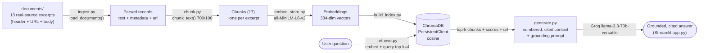

# Project 1 Planning: The Unofficial Guide

> Spec written before the pipeline code. Retrieval Approach and Chunking Strategy were
> updated to match what was implemented; the corpus was later switched from simulated
> samples to **real, collected sources** (see Documents), and this spec updated to match.

---

## Domain

**Campus dining at the University of Michigan (Ann Arbor).**

The system answers questions about U-M's residential dining halls, meal plans, and dietary
options using **real student-generated and student-press knowledge** — Michigan Daily
reviews and opinion columns, a food-allergy blogger's guide, and a campus dining guide.

This knowledge is valuable and hard to find officially because the M|Dining website lists
menus, hours, and prices but does **not** tell you that South Quad is the consensus best
hall (and the only one with a kosher kitchen), that Bursley on North Campus feels "busy at
best and overwhelming at worst," that Mojo is worth the trip for its gooey cookies, or that
the Unlimited plan only pays off if you actually eat in the halls every day. That candid,
comparative signal lives in student reviews and opinion writing — exactly this corpus.

---

## Documents

13 documents drawn from **9 distinct real sources** (URLs below). To respect each source's
copyright/ToS on a public repo, each document stores an **attributed excerpt** (representative
quotes + a faithful factual summary) plus the source URL — not a full copy.

| # | Source | Type | URL |
|---|--------|------|-----|
| 1 | The Michigan Daily — Dining hall reviews (South Quad) | review | https://www.michigandaily.com/arts/campus-culture-reviews-dining-hall-edition/ |
| 2 | The Michigan Daily — Dining hall reviews (Mosher-Jordan/Mojo) | review | https://www.michigandaily.com/arts/campus-culture-reviews-dining-hall-edition/ |
| 3 | The Michigan Daily — Dining hall reviews (Twigs at Oxford) | review | https://www.michigandaily.com/arts/campus-culture-reviews-dining-hall-edition/ |
| 4 | The Michigan Daily — Dining hall reviews Part 2 (Bursley) | review | https://www.michigandaily.com/arts/campus-culture-reviews-dining-hall-edition-part-2/ |
| 5 | The Michigan Daily — Dining hall reviews Part 2 (North Quad) | review | https://www.michigandaily.com/arts/campus-culture-reviews-dining-hall-edition-part-2/ |
| 6 | The Michigan Daily — Dining hall reviews Part 2 (East Quad) | review | https://www.michigandaily.com/arts/campus-culture-reviews-dining-hall-edition-part-2/ |
| 7 | The Michigan Daily — "My beef with MDining" (opinion) | opinion | https://www.michigandaily.com/opinion/columns/my-beef-with-mdining/ |
| 8 | The Michigan Daily — new meal plans / dining dollars (news) | news | https://www.michigandaily.com/news/university-housing-announces-new-meal-plans-dining-dollar-expansion |
| 9 | M\|Dining — Nutrition & allergen info (vegan/vegetarian) | guide | https://dining.umich.edu/about-our-food/nutrition/ |
| 10 | M\|Dining — Religious observance (halal/kosher) | guide | https://dining.umich.edu/meal-plans-rates/religious-observance/ |
| 11 | MI Gluten Free Gal — U-M food allergy guide | guide | https://miglutenfreegal.com/university-of-michigan-food-allergy/ |
| 12 | Campus Visitor Guides — U-M campus dining overview | guide | https://campusvisitorguides.com/umich/campus-dining/ |
| 13 | The Michigan Daily — signature foods (cross-hall) | review | https://www.michigandaily.com/arts/campus-culture-reviews-dining-hall-edition/ |

*(Reddit's r/uofm was the intended fourth source but is bot-blocked to automated fetching;
the simulated first-draft corpus is preserved under `sample_documents_simulated/` as a
reproducible pipeline-test fixture.)*

---

## Chunking Strategy

**Chunk size:** 700 characters (~150 tokens). **Overlap:** 100 characters.

**Reasoning:** Documents are short, single-topic **attributed excerpts** (~80–160 words),
so each one is essentially one self-contained, citable thought about a single hall or topic.
At 700 chars / ~150 tokens, the chunker keeps each excerpt **whole in a single chunk** while
staying well under `all-MiniLM-L6-v2`'s 256-token input cap (no silent truncation). The
100-char overlap and paragraph-aware packing matter for the few longer excerpts. Because the
excerpts are short, the corpus is small — **17 chunks across 13 documents** — which is below
the 50-chunk rule of thumb, but that's a deliberate consequence of storing *excerpts* rather
than full articles (ToS/copyright), not of over-large chunks: chunk sizes span 72–780 chars.

**Final chunk count:** 17.

---

## Retrieval Approach

**Embedding model:** `all-MiniLM-L6-v2` via `sentence-transformers` — 384-dim, local, fast,
strong on short text, which is exactly this excerpt corpus.

**Top-k:** 4 — enough to surface the specific hall's review plus the relevant official/guide
doc, without flooding the LLM with loosely related halls. Stored with **cosine** distance;
distance → `similarity = 1 − distance` for display and the low-relevance cutoff.

**Production tradeoff reflection:** With cost no object I'd weigh a larger hosted embedding
model (e.g. OpenAI `text-embedding-3-large`, Voyage, Cohere). **Domain accuracy** is the big
one here: a small general model conflates similar proper nouns — it scores "North **Quad**"
as near "North **Campus**" on the shared token (this caused my documented failure case), and
a stronger or lightly fine-tuned model would separate campus place-names better. **Context
length** would let me embed whole articles instead of excerpts. **Multilingual** support
would help an international student body. Against all that: local MiniLM is free and instant,
while a hosted model adds per-query latency and indexing cost — for a class project the
local model wins; for production I'd A/B and measure whether the accuracy gain is worth it.

---

## Evaluation Plan

| # | Question | Expected answer |
|---|----------|-----------------|
| 1 | Which U-M dining hall has the only kosher kitchen on campus? | South Quad — it houses the only kosher kitchen on campus (also has a halal station). (docs 01, 10) |
| 2 | Why do students criticize the Bursley dining hall? | It feels "busy at best and overwhelming at worst," with only ~4 food stations vs. up to 10 elsewhere, and small paper plates; it's the North Campus hall students are stuck with. (doc 04) |
| 3 | What is the Mosher-Jordan (Mojo) dining hall known for? | Its desserts — especially the famous Mojo cookie, a gooey, intentionally-undercooked chocolate-chip cookie; "Mojo's dessert always reigns supreme." (docs 02, 13) |
| 4 | How much is a single dinner at a U-M dining hall, and is the Unlimited plan worth it? | ~$15.25 for a single lunch/dinner; the Unlimited Basic plan is ~$575/month (~$19/day) — reasonable if you eat in the halls daily, a loss if you go home weekends. (docs 08, 07) |
| 5 | Where can students find gluten-free options in U-M dining halls? | Dedicated, locked gluten-free rooms at South Quad and Bursley (MCard access after cross-contact training); gluten-free pasta in all halls; separate prep at 24 Carrots and Wildfire. (doc 11) |

---

## Anticipated Challenges

1. **Similar proper nouns confuse the embedding model.** "North Quad" (a Central Campus
   hall) and "North Campus" (where Bursley is) share the token "North," so a small general
   embedding model scores them as similar and retrieves the North Quad review for a North
   Campus query. This is the most likely source of a factual error and is exactly the
   documented failure case. Mitigation options: a stronger embedding model, or hybrid
   (BM25) retrieval to anchor on exact phrases.

2. **Short excerpts mean thin coverage of specifics.** Because documents are excerpts, the
   corpus has no operational specifics like exact dining-hall hours or daily menus. Questions
   about those should fail closed rather than be fabricated. Mitigation: the low-relevance
   cutoff returns "not enough information" (verified on "what time does South Quad close?").

3. **General overview vs. specific source.** The campus-dining overview (doc 12) mentions
   many topics shallowly, so it can out-rank the more specific review/guide on a broad query
   and dilute the answer. Mitigation: top-k=4 keeps the specific doc in context alongside it.

---

## Architecture

**Stage → tool:** Ingestion `ingest.py` · Chunking `chunk.py` · Embedding
`sentence-transformers` · Vector store `chromadb` · Retrieval `retrieve.py` ·
Generation Groq (`generate.py`) · Interface `streamlit` (`app.py`) ·
Measurement `evaluate.py`. Document collection used `WebFetch` against the source URLs.

---

## AI Tool Plan

**Milestone 3 — Ingestion and chunking:** Give the AI the Chunking Strategy section and the
document header format (`title / source_type / source / url`), and ask it to implement
`load_documents()` (parse the `---` header → metadata incl. `url`, strip HTML/markdown) and a
paragraph-aware `chunk_text()`. Verify by printing chunk count + 5 random chunks and checking
for empty/HTML/wrong-metadata chunks.

**Milestone 4 — Embedding and retrieval:** Give the Retrieval Approach section (model, top-k,
cosine) and ask for the ChromaDB store (carrying `url` in metadata) and `retrieve()`. Verify
with a no-LLM test on the 5 eval questions, checking distances and that the right source
returns.

**Milestone 5 — Generation and interface:** Give the Grounded Generation design (numbered +
source-titled context, the strict prompt, the low-relevance cutoff, programmatic source list
with URLs) and ask for `answer_question()` + a Streamlit app. Verify on the 5 questions, an
out-of-corpus question (refusal), and inspect citations.

---

## Stretch Features

> Added after the core pipeline; this section is updated before starting each.

### 1. Hybrid Search (semantic + BM25)
Dense search conflates similar proper nouns (the North Quad / North Campus failure). BM25
keyword search anchors on exact phrases, so fusing the two rankings with Reciprocal Rank
Fusion should help on name-specific queries. Compare hybrid vs. semantic-only on the eval set
(`compare_retrieval.py`).

### 2. Chunking Strategy Comparison
Compare chunk sizes on the same query set (`compare_chunking.py`). With short excerpts,
chunking is expected to have little effect (each excerpt is ~one chunk) — itself an honest
finding worth measuring rather than assuming.

### 3. Metadata Filtering
Each chunk carries `source_type` (review / opinion / news / guide). Allow restricting
retrieval to a subset (e.g. only `review`) via a ChromaDB `where` clause + a sidebar control.

### 4. Conversational Memory
Multi-turn chat with history-aware query rewriting so a follow-up ("is it good for vegans?")
is rewritten to a standalone query using prior turns, before retrieval. Grounding and the
off-topic guard are unchanged — memory only affects the search query.
